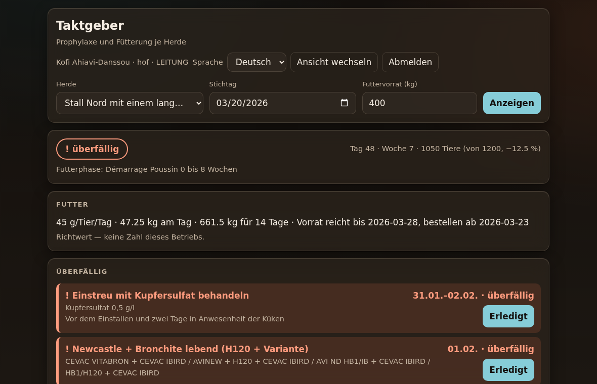

# elevage-e2e — der Taktgeber

Ein Werkzeug für die Geflügelhaltung: es taktet **Prophylaxe** und
**Fütterung** je Herde, rechnet aus dem Einstalldatum, meldet Überfälliges
und sperrt einen Mischauftrag, dessen Rezept nicht aufgeht.

**Leitsatz:** Der Plan entscheidet, nicht das Gefühl — und schon gar nicht
ein Sprachmodell. Ein Impftermin fällt aus einer Subtraktion, sonst aus
nichts.

## Was es kann

```bash
python3 -m elevage.cli demo                       # drei Szenarien, ohne Datenbank

python3 -m elevage.cli einstallen --betrieb hof --herde H1 --name "Stall Nord" \
    --tierart LEGEHENNE --einstall 2026-03-02 --tiere 1200
python3 -m elevage.cli herden --betrieb hof
python3 -m elevage.cli tagesbild --betrieb hof --herde H1 --stichtag 2026-03-06 --mischen 500 --vorrat 400
python3 -m elevage.cli quittieren --betrieb hof --herde H1 \
    --schritt PONDEUSE_J7_GUMBORO_1 --am 2026-03-08 --durch Kofi --lot LOT-4711
python3 -m elevage.cli gemischt --betrieb hof --herde H1 --kg 500 --am 2026-03-09
python3 -m elevage.cli verzehr --betrieb hof --herde H1
python3 -m elevage.cli vorfall --betrieb hof --herde H1 --art GUMBORO --am 2026-03-24
python3 -m elevage.cli ausstallen --betrieb hof --herde H1   # Historie bleibt

python3 -m elevage.cli mischung --rezept PONTE_AB_21 --kg 1000 [--normieren]

python3 -m elevage.cli rezept --betrieb hof --rezept PONTE_AB_21 \
    --artikel MAIS --kg 43.3 --grund "am Original geprüft" --am 2026-03-20
python3 -m elevage.cli pruefliste --betrieb hof        # Exit 2, solange etwas offen ist
python3 -m elevage.cli einstellung --betrieb hof \
    --schluessel notfall.dosis.LEGEHENNE --wert "0,75 g/l"
python3 -m elevage.cli benutzer --betrieb hof --anlegen kofi --name "Kofi A." --rolle LEITUNG

python3 -m elevage.cli ui                    # Oberfläche auf 127.0.0.1:8791
```

Die Datenbank liegt unter `~/.elevage/elevage.db`; `--db` oder die
Umgebungsvariable `ELEVAGE_DB` legen sie woandershin.

`tagesbild` beendet sich mit Code 2, wenn etwas überfällig ist — damit kann
ein Wächter-Job daran hängen, ohne die Ausgabe zu lesen.

## Aufbau

| Modul | Aufgabe |
|---|---|
| `models.py` | Der Vertrag (Pydantic, JSON bleibt camelCase) — Änderungen hier zuerst |
| `programme.py` | Die beiden Prophylaxe-Programme als Daten, verbatim von den Blättern |
| `rezepte.py` | Die drei Futter-Rezepturen + Artikelstamm |
| `plan.py` | Vorlage + Herde = Termine mit echten Daten, Ampel, Quittungen |
| `mischung.py` | Rezept × Chargengröße, mit Summenprobe und Sperre |
| `takt.py` | `rechne(herde, stichtag)` — das ganze Tagesbild |
| `notfall.py` | Gumboro-Schema und Leberschutz beim Futterwechsel (NB-Kasten) |
| `verzehr.py` | Verzehrkurve: gemessen aus dem Mischprotokoll, sonst Richtwert |
| `archiv.py` | SQLite (Stdlib): Herden, Quittungen, Mischprotokoll, Vorfälle |
| `betrieb.py` | Die Naht: Archiv rein, Tagesbild raus |
| `seite.py` | Die ganze Oberfläche als ein String — kein Build, kein CDN |
| `server.py` | Stdlib-HTTP-Server: Sitzungen, Rollen, Ratenbremse |
| `anmeldung.py` | Passwörter (scrypt) und Sitzungsmerkmale |
| `anpassung.py` | Blatt + Betriebsanpassungen = wirksames Rezept |
| `einstellung.py` | Was vom Blatt abweichen darf, weicht hier ab |
| `cli.py` | Dünne Schale, keine eigene Logik |

Datenfluss: `Herde` + `Stichtag` → `plan.schritte_fuer()` (Programm +
Legeperiode + Futterwechsel + ausgelöste Notfallschemata) →
`plan.baue_termine()` → `takt.rechne()` → `Tagesbild`. Die Oberfläche hängt
nur daran und ist austauschbar.

## Die Verzehrkurve lernt sich selbst

Ohne g/Tier/Tag gibt es keine Reichweite und keinen Bestelltag. Die Zahl
kommt aus zwei Quellen, in dieser Reihenfolge:

1. **Gemessen** aus dem eigenen Mischprotokoll — was zwischen zwei
   Mischungen verbraucht wurde, geteilt durch Tierzahl und Tage. Rasse,
   Klima und Fütterung stecken darin schon drin.
2. **Richtwert** als Lückenfüller. Die Werte in `verzehr.py` sind grobe
   Orientierung, **keine Betriebsdaten**, und werden von jedem gemessenen
   Punkt geschlagen.

Jeder Kurvenpunkt trägt seine Herkunft, und jede Prognose auf Richtwerten
sagt das im Klartext. Drei protokollierte Mischungen genügen, damit die
ersten Wochen auf eigenen Zahlen stehen.

## Was ein Vorfall auslöst

`elevage vorfall --art GUMBORO --am …` legt ein Ereignis ab und erzeugt
daraus zwei ganz normale Schritte — gleiche Ampel, gleiche Quittung:

| Tage | Schritt |
|---|---|
| Tag des Vorfalls + 3 | Desinfektion (VIRKON/VIRUNET) + Antikokzidium 1 g/l |
| danach + 3 | Leberschutz, um die Futteraufnahme wieder anzuschieben |

Dazu ohne Ereignis, aus den Rezepten abgeleitet: **Leberschutz von j-1 bis
j+2 um jeden Futterwechsel** (Tag 57 und Tag 148) — das verlangt der
NB-Kasten des Junghennen-Blattes, und es steht in keinem Tagesraster.

## Demo ansehen

**https://rawkeep.github.io/elevage-e2e/** — dieselbe Oberfläche mit
erfundenen Betriebsdaten. Abhaken, Rückgängig und die drei Ausgleichswege
funktionieren; Eingaben bleiben im Browser, gespeichert wird nichts.

Es gibt **nur eine Oberfläche**: die Demo ist `seite.SEITE`, davor geschoben
eine Attrappe für `fetch`, die vorgerechnete Antworten liefert statt den
Server zu fragen (`tools/baue_demo.py`). Die Zahlen kommen aus
`takt.rechne()` mit festem Stichtag. Der Pages-Lauf baut die Datei neu und
vergleicht sie mit der eingecheckten — eine Demo, die von der Engine
abgedriftet ist, geht nicht online.

```bash
python3 -m tools.baue_demo    # schreibt docs/index.html
```

**Einmalig einzuschalten:** *Settings → Pages → Build and deployment →
Source: **GitHub Actions***. Das Token des Workflows darf die Pages-Seite
nicht selbst anlegen, nur auf eine bestehende veröffentlichen. Bis der
Schalter steht, scheitert der Lauf an `configure-pages` — absichtlich,
denn eine stille Weiterfahrt hieße, es sei veröffentlicht.

Pages kann den Taktgeber selbst nicht hosten: die Anwendung braucht Python
und eine Datenbank, Pages liefert nur Dateien. Dafür sind `Dockerfile` und
`fly.toml` da.

## Die Oberfläche

`elevage ui` startet einen Stdlib-HTTP-Server auf `127.0.0.1:8791`. Die
Seite ist **ein String in `seite.py`** — kein Bundler, keine Datei daneben,
**0 externe Requests** (ein Test hält das fest, die Abnahme misst es am
echten Netzverkehr).



Gestaltet nach dem Architektur-Briefing (Agrar, intern): erdige Töne statt
Agrar-Grün, 17 px Grundschrift und Touch-Ziele ab 44 px für die Bedienung
im Stehen und mit Handschuhen, Dark Mode über Tokens, Bewegung nur mit
`prefers-reduced-motion`. **Farbe trägt nie allein** — jede Ampel hat
zusätzlich ein Zeichen und ein Wort („! überfällig", „› jetzt dran").
Abhaken folgt dem Undo-Muster: sofort ausführen, Toast mit „Rückgängig",
keine Bestätigungskaskade.

## Anmeldung

**Der Betrieb kommt aus der Sitzung, nie aus der Anfrage.** Damit ist die
Mandantentrennung eine Grenze und kein Auswahlfeld: wer angemeldet ist,
sieht genau einen Betrieb, und kein Parameter ändert das.

```bash
elevage benutzer --betrieb hof --anlegen kofi --name "Kofi A." --rolle LEITUNG
elevage benutzer --betrieb hof --sperren kofi
```

Das Passwort wird abgefragt, nicht als Argument übergeben — sonst stünde es
in der Shell-Historie.

| Rolle | darf |
|---|---|
| `LESER` | sehen |
| `STALL` | zusätzlich abhaken, Vorfälle melden, mischen und buchen |
| `LEITUNG` | zusätzlich Prüfvermerke abhaken (= am Original verglichen) |

**Abweichung vom Briefing, bewusst und benannt:** dort steht „Standard-Auth
(OIDC/OAuth2 oder bewährte Lib) statt Eigenbau". Es gibt hier keinen
Identitätsanbieter und keine Fremdbibliothek, weil der Kern dep-arm bleibt
und der Betrieb offline läuft. Gebaut ist das Kleinste, was verteidigbar
ist — und **keine eigene Krypto**:

* `hashlib.scrypt` aus der Standardbibliothek als Schlüsselableitung, mit
  den Parametern im Hash, damit sie später erhöht werden können.
* Vergleiche über `hmac.compare_digest`, nie über `==`.
* Das Sitzungsmerkmal liegt **nur als SHA-256** in der Datenbank. Wer die
  Datei kopiert, hat damit keine gültige Sitzung.
* Cookie `HttpOnly` + `SameSite=Strict`, dazu ein Origin-Abgleich bei jedem
  POST. Anmeldeversuche sind gebremst (5 in 15 Minuten, je Konto **und** je
  Herkunft), und die Antwort unterscheidet nie zwischen „Konto unbekannt"
  und „Passwort falsch".

Kommt später OIDC dazu, ist `anmeldung.pruefe_passwort` die eine Naht, die
getauscht wird — sonst nichts.

## Betrieb

`elevage ui` bindet auf `127.0.0.1`. Für eine andere Adresse braucht es
`ELEVAGE_ALLOW_REMOTE=1`, und dann gehört **TLS davor** — ohne
`ELEVAGE_SECURE_COOKIE=1` warnt der Start, weil Passwort und Sitzung sonst
im Klartext reisen.

`Dockerfile` und `fly.toml` liegen bei: ein Deployable, SQLite auf einem
Volume, scale-to-zero, Region `cdg` (näher an Westafrika als `fra`). Kein
Build-Schritt fürs Frontend — die Seite ist ein String im Paket.

```bash
fly launch --no-deploy   # einmalig, App-Namen bestätigen
fly volumes create elevage_daten --size 1
fly deploy
fly ssh console -C "python -m elevage.cli benutzer --betrieb hof --anlegen kofi --name 'Kofi A.' --rolle LEITUNG"
```

## Wenn ein Rezept nicht auf 100 kg aufgeht

Drei Wege, und die Ausgabe sagt immer, welcher gegangen wurde:

| Weg | was passiert | Ponte auf 1000 kg |
|---|---|---|
| `AUSGLEICH` (Vorgabe) | Überhang aus **einem** benannten Posten, dem Energieträger | Mais 500 → **433 kg**, Rest unberührt, 1000 kg im Mischer |
| `VERBATIM` | gerechnet wie das Blatt | 1067 kg im Mischer — nicht buchbar |
| `ANTEILIG` | alles gleichmäßig skaliert | 1000 kg, aber auch Kalk und Methionin sinken |

Warum ein Posten und nicht alle: Kalk, Aminosäuren und Konzentrat stehen für
eine **Funktion**; ihre Menge ist die Aussage des Rezepts, nicht sein Puffer.
Mais ist der Füller und trägt den Abschreibfehler. Gesperrt wird nur noch,
was kein Abschreibfehler mehr sein kann — über 15 kg je 100 kg, oder wenn
der Ausgleichsposten gar nicht reicht.

Jeder Ausgleich hinterlegt einen **Prüfvermerk** mit Vorher-Nachher-Wert und
Quelle. Er bleibt offen, bis ihn jemand mit `LEITUNG`-Rolle abhakt, und kommt
danach nicht zurück. `elevage pruefliste` endet mit Code 2, solange etwas
offen ist — damit lässt sich ein Wächter daranhängen.

## Mengen und Dosen sind anpassbar

Das Blatt bleibt im Code stehen und wird **nie** überschrieben. Was der
Betrieb ändert, liegt als Anpassung daneben; jeder Posten trägt danach seine
Herkunft und den Blattwert:

```
MAIS               43.30 kg/100kg  Betrieb Mais  (Blatt: 50.00)
SOJA_TOURFIE       14.00 kg/100kg  Blatt   Soja torréfié
SUMME             100.00 kg/100kg  (+0.00)
```

0 kg heißt: der Posten entfällt. Ebenso ist die **Desinfektionsdosis im
Gumboro-Schema** eine Einstellung — Vorgabe bleibt der Wert des eigenen
Blattes, und der Befund sagt, ob die Zahl vom Blatt oder vom Betrieb kommt.
Unbekannte Einstellungsschlüssel werden abgewiesen, nicht abgelegt.

## Regeln, die nicht gebrochen werden

1. **Der Stichtag kommt herein, nie aus der Uhr.** Sonst ist kein Lauf
   reproduzierbar und kein Test aussagekräftig.
2. **Vorlage und Termin sind getrennt.** Ein geändertes Programm darf die
   Historie einer laufenden Herde nicht rückwirkend verfälschen.
3. **Abhaken ist ein Ereignis, kein überschriebenes Feld.** Damit gibt es
   beim Offline-Sync keinen Konflikt, nur zwei Einträge und eine sichtbare
   Frage — und mehrfach gesendete Quittungen sind harmlos.
4. **Widersprüche der Blätter werden gemeldet, nicht geglättet.** Die
   Rezepte summieren sich nicht auf 100 kg; der Mischauftrag rechnet
   verbatim und sagt, was tatsächlich in den Mischer geht. Normiert wird
   nur auf ausdrückliche Anweisung.
5. **Lücken werden benannt, nicht als Null verbucht.** Für Masthühner gibt
   es kein Futterblatt; ohne Verzehrkurve gibt es keine Reichweite.
6. **Tenant-ID in jedem Datensatz**, Trennung schon im Kern — nicht erst in
   der Query. `test_jede_fachtabelle_hat_eine_tenant_id` bewacht das als
   Fitness-Function: eine neue Tabelle ohne Mandanten fällt sofort auf.
7. **Ausstallen löscht nicht**, es setzt inaktiv — die Historie bleibt.
8. **Ein gesperrter Mischauftrag wird nicht protokolliert.** Was nicht
   freigegeben ist, wurde nicht gemischt.
9. **Tuning steht als Konstante am Modulanfang**, keine Magic Numbers.
10. **Migrationen sind nummeriert** und laufen vorwärts gegen eine
    Versionstabelle — kein ad-hoc `ALTER` im Code.
11. **Das Blatt wird nie überschrieben.** Betriebswerte liegen daneben, und
    jeder Posten trägt seine Herkunft.
12. **Kein Ausgleich ohne Prüfvermerk.** Eine geglättete Zahl, die niemand
    mehr nachsieht, ist schlimmer als eine, die anhält.

## Befunde aus den Quellblättern

| Befund | Wo |
|---|---|
| Rezept *Ponte* summiert auf **106,7 kg** je 100 kg (+6,7) | `rezepte.py` |
| *Démarrage* und *Poulette* summieren auf 101,1 kg (+1,1) | `rezepte.py` |
| Binder steht als **ALFABIND** und **AFABIND** — ein Artikel | `ARTIKEL_ALIAS` |
| J12 und J17 heißen beide „2ème Vaccin GUMBORO" | `programme.py` |
| ND-Auffrischung Tag 57–60 steht in der Woche-7-Zeile **und** als Woche 9 | `programme.py` |
| Woche-6-Zeile ist auf Tag 35–40 datiert, Woche 6 ist Tag 36–42 | `programme.py` |
| Futterphasen überlappen an den Rändern (0–8/8–21, 8–21/ab 21) | `rezepte.py` |
| Für Masthühner liegt **kein** Futterblatt vor | `rezepte.py` |
| Notfall-Dosis: 0,5 g/l (Masthuhn) vs. 1 g/l (Junghenne) — zwei Zahlen für dasselbe Mittel | `notfall.py` |

Quelle der Prophylaxe-Programme: IVOGRAIN. Quelle der Rezepturen:
handschriftliche Betriebsblätter.

## Nach jeder Änderung

```bash
python3 -m ruff format . && python3 -m ruff check . && python3 -m mypy && python3 -m pytest -q
```
